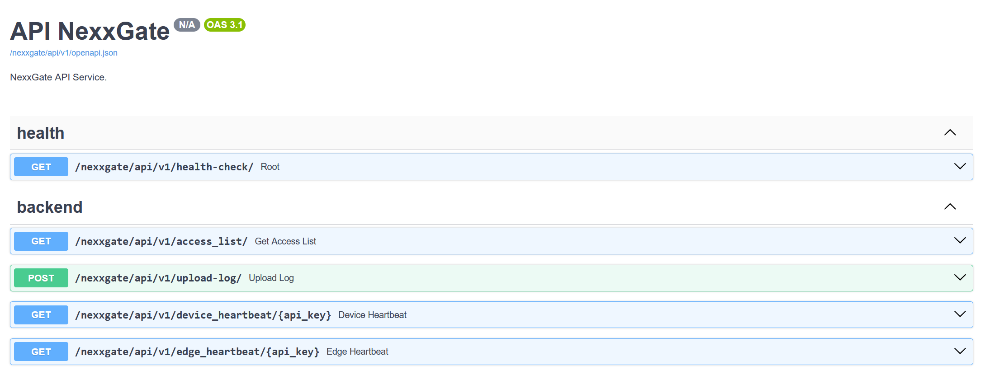

# NexxGate - Backend

## Table of Contents
+ [About](#about)
+ [Live Demo](#demo)

## About <a name = "about"></a>
Backend implementation of NexxGate, implemented in Python using FastAPI.

Running the server on Ubuntu:
```bash
    pip install -r requirements.txt
    screen -S nexxgate
    source env/bin/activate
    uvicorn main:app --host 0.0.0.0 --port 8000
    detach with Ctrl+A, D
```

## Live Demo <a name = "demo"></a>
The backend is hosted on a EC2 node in Amazon AWS, and can be accessed at [Backend Swagger Docs](
http://54.235.119.167:8000/nexxgate/api/v1/docs)


