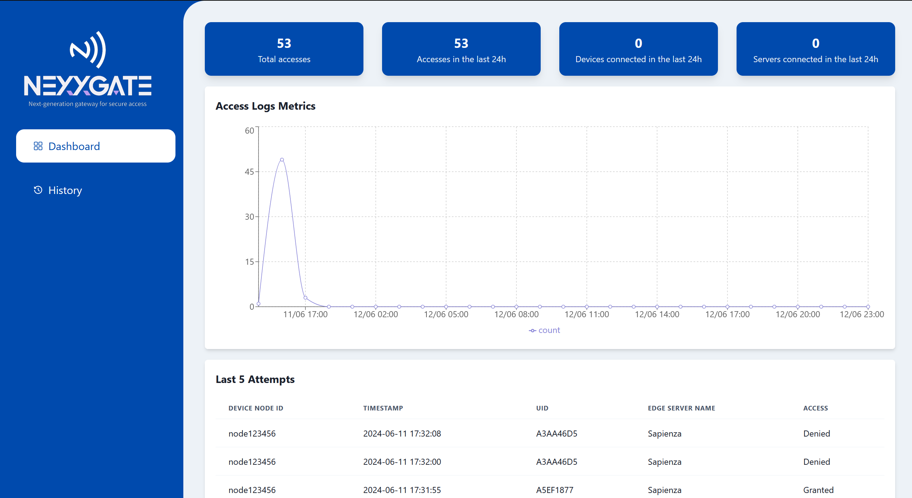

# NexxGate - Frontend

## Table of Contents
+ [About](#about)
+ [Live Demo](#demo)

## About <a name = "about"></a>
Frontend implementation of NexxGate, implemented in React with Vite.

Running the frontend on Ubuntu:
```bash
    npm install
    npm run dev
```

## Live Demo <a name = "demo"></a>
The frontend is hosted on Amazon S3, and can be accessed at [Frontend](
http://nexxgate.s3-website-us-east-1.amazonaws.com/)


```
